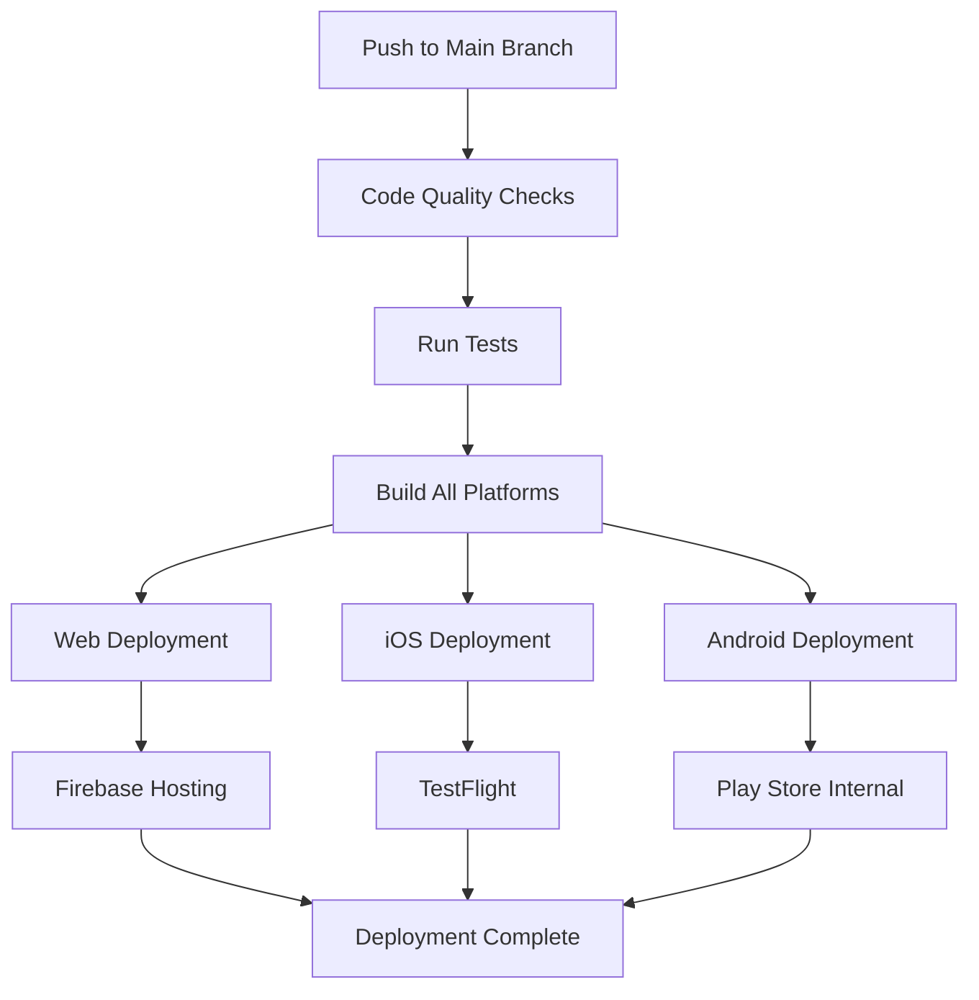

# Flutter Multi-Platform Deployment Guide

This comprehensive guide covers deployment strategies for Flutter applications across web, iOS, and Android platforms using automated CI/CD pipelines.

## Overview

This project supports automated deployment to:
- **Web**: Firebase Hosting
- **iOS**: TestFlight (Beta Testing)
- **Android**: Google Play Store (Internal Testing)

## Quick Start

### 1. Web Deployment (Firebase Hosting)

**Required Secrets:**
- `FIREBASE_SERVICE_ACCOUNT`: Firebase service account JSON
- `FIREBASE_PROJECT_ID`: Firebase project ID

**Setup:**
1. Create Firebase project
2. Enable Firebase Hosting
3. Generate service account key
4. Add secrets to GitHub repository

**Documentation:** [Firebase Hosting Setup](./firebase-hosting-setup.md)

### 2. iOS Deployment (TestFlight)

**Required Secrets:**
- `APPSTORE_API_PRIVATE_KEY`: App Store Connect API private key (.p8 content)
- `APPSTORE_API_KEY_ID`: App Store Connect API key ID
- `APPSTORE_ISSUER_ID`: App Store Connect issuer ID

**Setup:**
1. Create App Store Connect API key with "App Manager" role
2. Download the .p8 private key file
3. Add secrets to GitHub repository

**Documentation:** [TestFlight Setup Guide](./testflight-setup.md) | [Quick Reference](./testflight-quick-reference.md)

### 3. Android Deployment (Google Play Store)

**Required Secrets:**
- `GOOGLE_PLAY_SERVICE_ACCOUNT`: Google Cloud service account JSON

**Setup:**
1. Create Google Cloud service account
2. Enable Google Play Developer API
3. Link service account to Play Console
4. Add secret to GitHub repository

**Documentation:** [Google Play Store Setup Guide](./google-play-setup.md) | [Quick Reference](./google-play-quick-reference.md)

## CI/CD Pipeline Overview

The automated pipeline includes:

### Code Quality Stage
- **Linting**: `flutter analyze`
- **Formatting**: `dart format --set-exit-if-changed`
- **Testing**: `flutter test`

### Build Stage
- **Web**: `flutter build web --release`
- **iOS**: `flutter build ios --release --no-codesign` + IPA creation
- **Android**: `flutter build apk --release` + `flutter build appbundle --release`

### Deployment Stage
- **Web**: Firebase Hosting deployment
- **iOS**: TestFlight upload
- **Android**: Play Store internal track upload

### Testing Stage
- **Integration Tests**: `flutter test integration_test/`
- **Security Scan**: Code quality and security checks
- **Performance Test**: Coverage and performance metrics

## Deployment Workflow

## Platform-Specific Considerations

### Web Deployment

**Advantages:**
- Instant deployment
- No app store review
- Easy updates
- Global CDN

**Considerations:**
- PWA features
- SEO optimization
- Browser compatibility
- Performance optimization

### iOS Deployment (TestFlight)

**Advantages:**
- No App Store review for internal testing
- Easy beta testing
- Team collaboration
- Fast iteration

**Considerations:**
- Apple Developer account required
- TestFlight limitations
- iOS-specific testing
- App Store Connect setup

### Android Deployment (Play Store)

**Advantages:**
- Multiple release tracks
- Flexible testing options
- Google Play App Signing
- Detailed analytics

**Considerations:**
- Google Play Console setup
- Service account management
- Release track management
- Play Store policies

## Environment Configuration

### Development Environment
- Local development
- Hot reload enabled
- Debug builds
- Local testing

### Staging Environment
- Pre-production testing
- Beta builds
- Internal testing
- Performance validation

### Production Environment
- Live production
- Release builds
- Public access
- Monitoring and analytics

## Security Best Practices

### Secret Management
- Use GitHub Secrets for all sensitive data
- Never commit API keys or certificates
- Regularly rotate credentials
- Monitor secret usage

### Access Control
- Use minimum required permissions
- Implement role-based access
- Regular access reviews
- Audit trail maintenance

### Code Security
- Regular security scans
- Dependency vulnerability checks
- Code quality gates
- Secure coding practices

## Monitoring and Analytics

### Error Tracking
- Firebase Crashlytics
- Sentry integration
- Custom error logging
- Performance monitoring

### Analytics
- User behavior tracking
- Performance metrics
- Deployment success rates
- Build time monitoring

## Troubleshooting

### Common Issues

1. **Build Failures**
   - Check Flutter version compatibility
   - Verify dependencies
   - Review build logs
   - Test locally first

2. **Deployment Failures**
   - Verify secrets are correct
   - Check API permissions
   - Review deployment logs
   - Test with manual upload

3. **Test Failures**
   - Review test logs
   - Check test environment
   - Verify test data
   - Update test cases

### Debug Steps

1. **Check GitHub Actions Logs**
   - Go to Actions tab
   - Click on failed workflow
   - Expand failed steps
   - Review error messages

2. **Test Locally**
   - Build locally first
   - Test deployment manually
   - Verify configurations
   - Check dependencies

3. **Verify Credentials**
   - Check secret values
   - Verify API permissions
   - Test API access
   - Review account status

## Best Practices

### Development Workflow
- Use feature branches
- Implement code reviews
- Run tests before merging
- Maintain clean commit history

### Release Management
- Semantic versioning
- Release notes
- Rollback strategies
- Gradual rollouts

### Quality Assurance
- Automated testing
- Code quality gates
- Security scanning
- Performance monitoring

## Support and Resources

### Documentation
- [Flutter Deployment Guide](https://docs.flutter.dev/deployment/)
- [GitHub Actions Documentation](https://docs.github.com/en/actions)
- [Firebase Documentation](https://firebase.google.com/docs)
- [Apple Developer Documentation](https://developer.apple.com/documentation/)
- [Google Play Console Help](https://support.google.com/googleplay/android-developer/)

### Community Resources
- [Flutter Community](https://flutter.dev/community)
- [GitHub Actions Marketplace](https://github.com/marketplace?type=actions)
- [Stack Overflow](https://stackoverflow.com/questions/tagged/flutter)
- [Flutter Discord](https://discord.gg/flutter)

## Related Documentation

- [CI/CD Pipeline Configuration](../.github/workflows/ci_cd.yml)
- [Flutter Architecture Rules](../FLUTTER_RULES_TESTING_GUIDE.md)
- [TestFlight Setup Guide](./testflight-setup.md)
- [Google Play Store Setup Guide](./google-play-setup.md)
- [Firebase Hosting Setup Guide](./firebase-hosting-setup.md)
- [Local Testing Guide](./github-actions-local-testing.md)

---

**Need Help?** Check the individual setup guides for each platform or refer to the troubleshooting sections for common issues.
